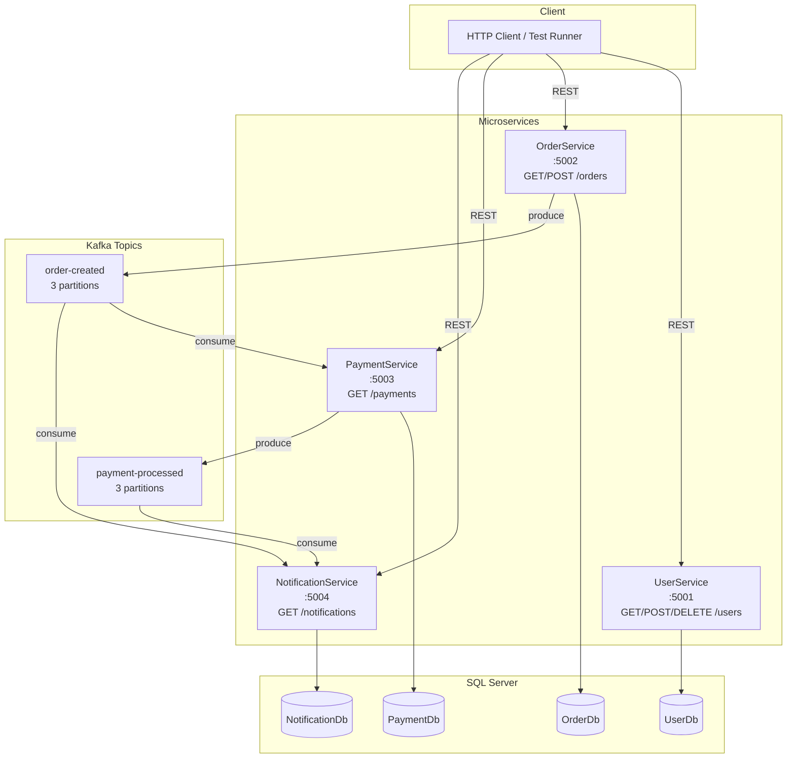
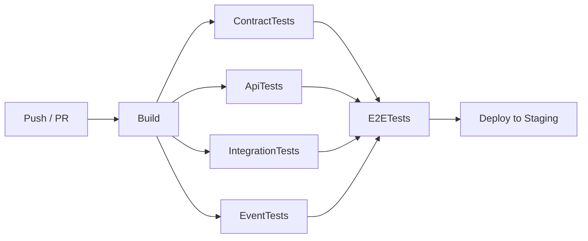

# Architecture Diagram

## System Overview



---

## Test Layer Overlay

```mermaid
graph LR
    subgraph "E2E Tests (Playwright)"
        direction LR
        E2E[FullOrderWorkflowTests<br/>creates user → order → polls payment → polls notifications]
    end

    subgraph "API Tests (RestSharp)"
        AT1[UserServiceTests]
        AT2[OrderServiceTests]
        AT3[PaymentServiceTests]
        AT4[NotificationServiceTests]
    end

    subgraph "Contract Tests (Pact)"
        CT1[OrderConsumerTests<br/>defines GET /users/{id} contract]
        CT2[UserProviderTests<br/>verifies UserService satisfies contract]
    end

    subgraph "Event Tests (Confluent.Kafka + NJsonSchema)"
        ET1[OrderCreatedEventTests<br/>produce → consume]
        ET2[PaymentProcessedEventTests<br/>produce → consume]
        ET3[SchemaValidationTests<br/>JSON Schema assertions]
    end

    subgraph "Integration Tests (Testcontainers)"
        IT1[UserServiceIntegrationTests<br/>WebApplicationFactory + SQL Server container]
        IT2[OrderServiceIntegrationTests<br/>no-op Kafka producer stub]
    end

    E2E -->|calls| AT1
    E2E -->|calls| AT2
    AT1 & AT2 & AT3 & AT4 -->|hit live services| AT1
    CT1 -->|generates pact JSON| CT2
```

---

## CI/CD Pipeline



---

## Port Map

| Service | Internal Port | External Port |
|---|---|---|
| UserService | 8080 | 5001 |
| OrderService | 8080 | 5002 |
| PaymentService | 8080 | 5003 |
| NotificationService | 8080 | 5004 |
| SQL Server | 1433 | 1433 |
| Kafka (external) | 9094 | 9094 |
| Kafka (internal) | 9092 | — |
